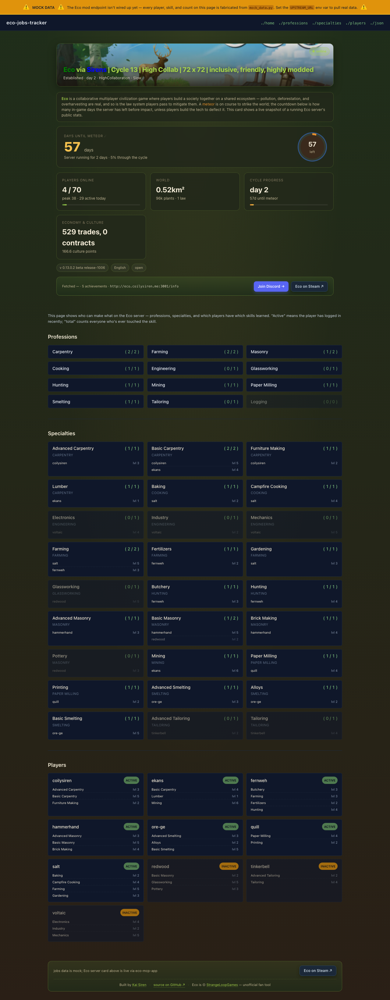

# eco-jobs-tracker

> **Naming.** `eco-jobs-tracker` is the canonical name (repo, subdomain `eco-jobs-tracker.coilysiren.me`, mod `EcoJobsTracker`). Deploy internals still carry the old `eco-spec-tracker` name (k8s namespace, Python package, image, SSM key, Sentry project). Renaming those is a separate, riskier surgery (k8s teardown + Sentry break). **Do not change `config.yml`'s `name`** - it cascades into every k8s resource and the image tag at deploy.

Read-only "who can make what" board for an **Eco** [1] server in 300 lines of FastAPI. Lists every player, profession, learned specialty, with live `active / total` counts.

Paired with a small C# Eco mod that exposes `GET /api/v1/skills`: the mod is the source of truth, this app is the view. Today the app reads mock data (`UPSTREAM_URL` unset); point it at the shell harness on `:5100` or the real mod and it switches over.


## Screenshot

[](https://eco-jobs-tracker.coilysiren.me/)

Live at [eco-jobs-tracker.coilysiren.me](https://eco-jobs-tracker.coilysiren.me/).

## How it works

Two processes:

1. **FastAPI app** (`src/eco_spec_tracker/main.py`) - Jinja2 + HTMX + Tailwind CDN. Serves `/`, `/professions`, `/specialties`, `/players`, HTMX partials under `/partials/*`, JSON mirror under `/api/v1/*`. The live server-status card imports directly from sibling `eco-mcp-app` [2].
2. **C# Eco mod** (`mod/src/`) - standard ModKit [3] UserCode mod, registers `GET /api/v1/skills`. The `mod/shell/` project is an ASP.NET Core harness on `:5100` with canned data so you can iterate without booting Eco.

`upstream.py` calls `/api/v1/skills` when `UPSTREAM_URL` is set, falls back to mock data otherwise.

## Quick start

```sh
make build-native
make run-native      # http://localhost:4100 with autoreload
```

Plus the C# shell harness in a second terminal:

```sh
make run-shell                                     # :5100
UPSTREAM_URL=http://localhost:5100/api/v1/skills make run-native
```

## Tests

```sh
make test
```

Smoke suite under `tests/test_smoke.py`: every page, every `/api/v1/*`, `/partials/eco-card` with upstream stubbed via [respx](https://lundberg.github.io/respx/), parser fed a mod-shaped fixture.

## Build the real mod

```sh
make build-mod       # mod/src/bin/Release/net10.0/EcoJobsTracker.dll
```

Drops into an Eco server's `Mods/EcoJobsTracker/` directory.

## Publishing to mod.io

See [`docs/modio.md`](docs/modio.md) for the canonical listing copy + zip shape. Bump `<Version>` in [`mod/src/EcoJobsTracker.csproj`](mod/src/EcoJobsTracker.csproj) before each upload.

## Deploy

Follows the `coilysiren/backend` template [4]. Target: `eco-jobs-tracker.coilysiren.me`.

## License & credits

MIT. Eco is a trademark of **Strange Loop Games** [5]; unofficial fan tool, not affiliated.

## References

1. <https://play.eco/>
2. <https://github.com/coilysiren/eco-mcp-app>
3. <https://github.com/StrangeLoopGames/EcoModKit>
4. <https://github.com/coilysiren/backend>
5. <https://www.strangeloopgames.com/>

## See also

- [AGENTS.md](AGENTS.md) - agent-facing operating rules.
- [docs/FEATURES.md](docs/FEATURES.md) - inventory of what ships today.
- [.coily/coily.yaml](.coily/coily.yaml) - allowlisted commands.

Cross-reference convention from [coilysiren/agentic-os#59](https://github.com/coilysiren/agentic-os/issues/59).
